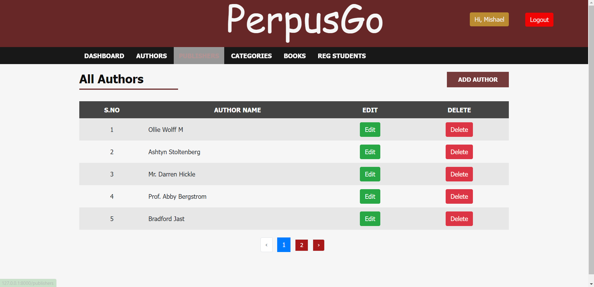
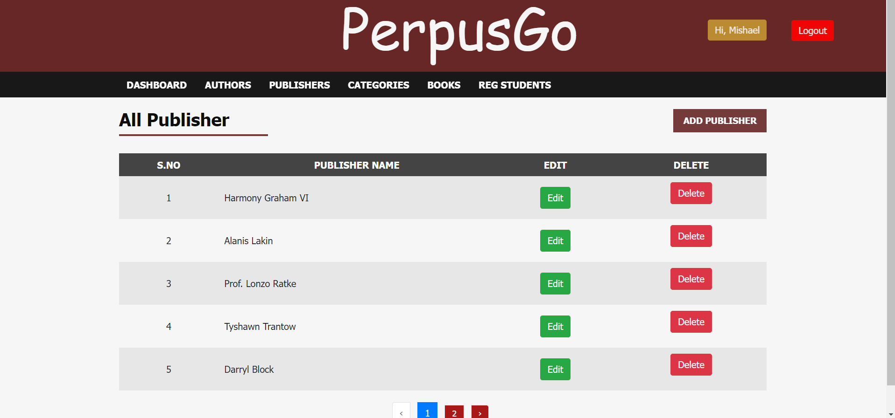
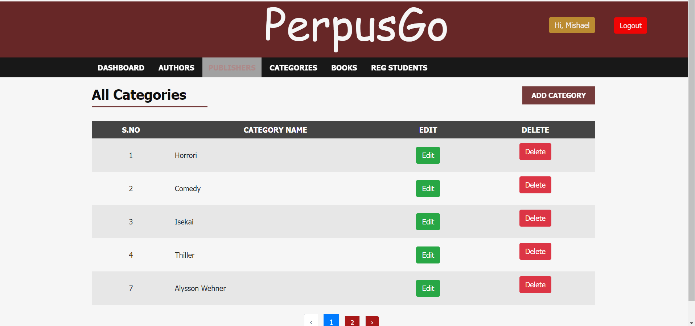
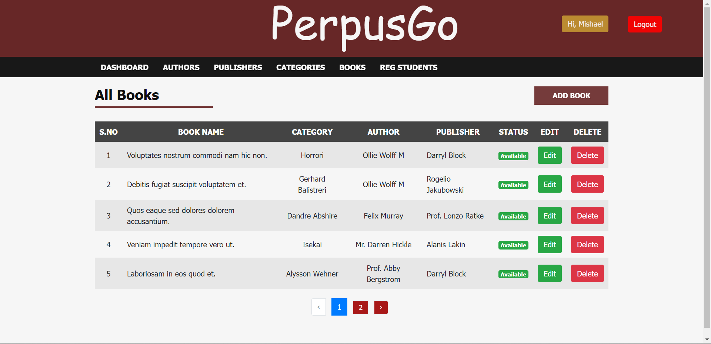

## PERPUS GO

## Anggota Kelompok
Pemograman Website - C :  
    - Achmed Ali Al Yusa (215150207111070) 
    - Mishael Ardhyta W (215150201111053)

## PENJELASAN PROGRAM

Nama Website : PerpusGo

PerpusGo merupakan sebuah website yang dirancang untuk menajemen buku didalam perpustakaan. Website ini memberi kemudahan bagi admin untuk mengatur buku, penulis buku, penerbit buku, Kategori Buku dan Data siswa yang tergabung dalam perpustakaan tersebut  

Fitur :  
    - Bisa menambah author, penulis Buku, Kategori Buku, dan Data Siswa
    - Bisa Menghapus author, penulis Buku, Kategori Buku, dan Data Siswa
    - Bisa Menupdate author, penulis Buku, Kategori Buku, dan Data Siswa

## SCREENSHOT
-Login Form  
   

-DashBoard  
   

-Authors  
   

-Publisher  
   

-Kategori  
   

-Books  
   

-Student  
   
